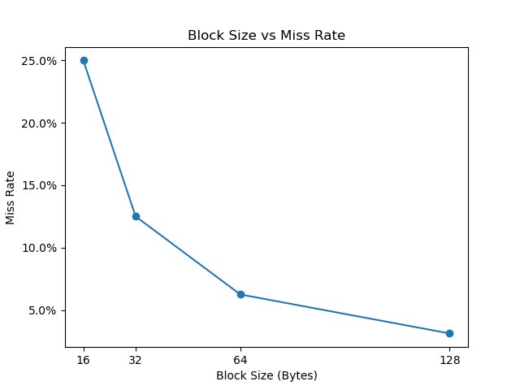
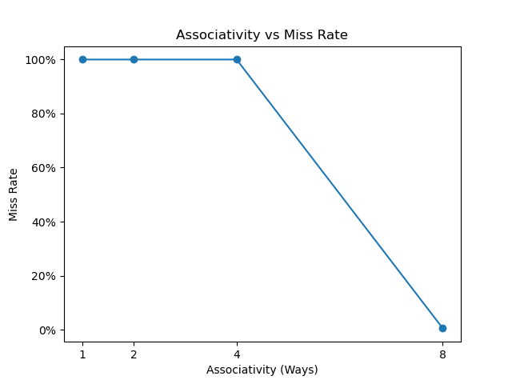

# Cache Simulator
A simple cache simulator implemented in C++ for studyingcache memory organization.

## Current Configuration

- 32-bit address
- Cache size : 32 KB
- Configurable block size
- Configurable associativity ('WAYS')
- Set-associative cache
- LRU replacement policy

## Implemented

- Address decomposition (Tag / Index / Block Offset)
- Memory trace file input
- Cache hit/miss detection and statistics
- Configurable cache size, block size, and associativity
- LRU replacement policy using access timestamps

## Experimental Results

### Effect of Block Size

To analyze the effect of spatial locality, the simulator was tested with sequential memory accesses while varying the cache block size

#### Configuration

- Cache Size: 32 KB
- Associativity: Direct-mapped (1-way)
- Memory Accesses: 1024
- Access Pattern: Sequential integer accesses (4 bytes apart)

#### Results

| Block Size | Hits | Misses | Miss Rate |
|------------|------|--------|-----------|
| 16 B | 768 | 256 | 25% |
| 32 B | 896 | 128 | 12.5% |
| 64 B | 960 | 64 | 6.25% |
| 128 B | 992 | 32 | 3.125% |

#### Analysis

Since the trace accesses consecutive memory addresses, it exhibits strong spatial locality.
When a cache block is loaded on a miss, subsequent accesses to nearby integers within the same block result in cache hits.
As the block size increases, more consecutive integers are fetched by a single cache miss, reducing the overall miss rate.

### Effect of Associativity

To analyze the effect of cache associaticity on conflict misses, the simulator was tested with multiple memory blocks that map to the same cache set.

#### Configuration

- Cache size = 32 KB
- Block size = 64 B
- Associativity: 1-way, 2-way, 4-way, 8-way
- Memory Accesses: 1000
-Access Pattern: Five memory blocks mapping to the same cache set

#### Results

| Associativity | Hits | Misses | Miss Rate |
|---------------|------|--------|-----------|
| 1-way | 0 | 1000 | 100% |
| 2-way | 0 | 1000 | 100% |
| 4-way | 0 | 1000 | 100% |
| 8-way | 995 | 5 | 0.5% |

#### Analysis

The trace repeatedly accesses five memory blocks that map to the same cache set.

With 1-way, 2-way, and 4-way associativity, the cache set cannot hold all five blocks simultaneously. Therefore, blocks are continuously replaced by the LRU replacement policy, resulting in frequent conflict misses.

With 8-way associativity, all five blocks can remain in the same set. After the first five compulsory misses, the remaining accesses result in cache hits.

This experiment demonstrates that increasing cache associativity can reduce conflict misses when multiple memory blocks compete for the same cache set.

## Future Work

- Write-through / Write-back policies
- Write-allocate / No-write-allocate policies
- Multi-level cache (L1 / L2)
- AMAT calculation